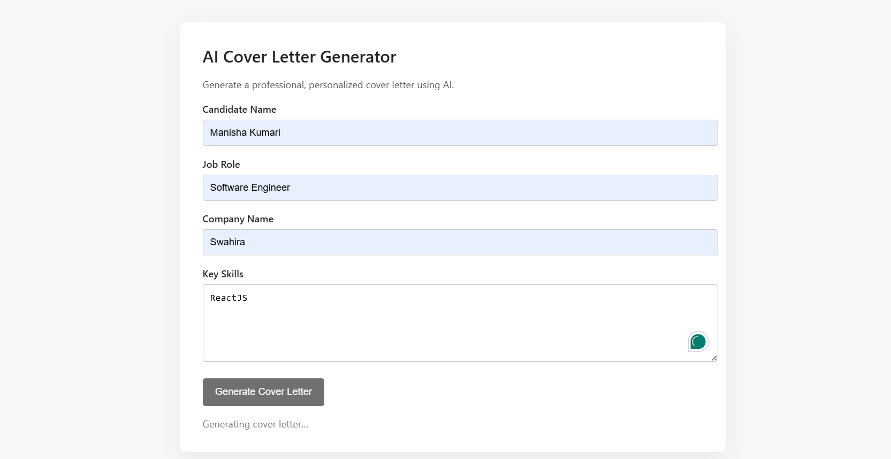
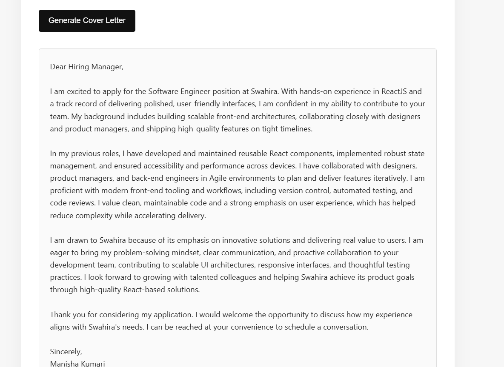
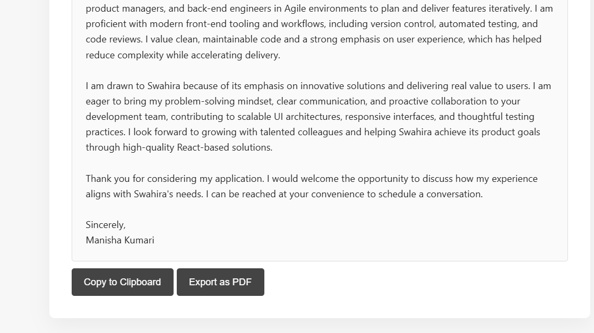

# AI Cover Letter Generator



An intelligent web application powered by Google's Gemini AI that generates personalized cover letters from your resume. Simply upload your resume and specify the job role or company details, and the AI will craft a tailored cover letter for you.

## Features

- **AI-Powered Generation**: Uses Google Gemini 2.0 Flash model for intelligent cover letter creation
- **Resume Parsing**: Automatically extracts information from uploaded PDF resumes
- **Quick Generation**: Get personalized cover letters in seconds
- **Copy to Clipboard**: One-click copying of generated content
- **Clean, Modern UI**: Responsive design with smooth interactions
- **Real-time Feedback**: Loading states and clear error messages

## Screenshot



## Tech Stack

### Backend

- **Node.js** with Express.js web framework
- **Google Generative AI** (Gemini 2.0 Flash) for AI-powered content generation
- **PDF Parse** for resume extraction
- **Multer** for file upload handling
- **CORS** for cross-origin requests

### Frontend

- **HTML5** for structure
- **CSS3** for styling with CSS variables and flexbox
- **Vanilla JavaScript** for interactivity

### Dependencies

```
@google/generative-ai: ^0.24.1
cors: ^2.8.6
dotenv: ^17.2.3
express: ^5.2.1
multer: ^2.0.2
pdf-parse: ^1.1.1
```

## Installation

1. **Clone or download** this repository

2. **Install dependencies**:

```bash
npm install
```

3. **Set up environment variables**:
   - Create a `.env` file in the project root
   - Add your Google Gemini API key:
   ```
   GEMINI_API_KEY=your_api_key_here
   PORT=3000
   ```

   - Get your API key from [Google AI Studio](https://aistudio.google.com)

## Usage

### Starting the Server

**Development mode** (with auto-reload):

```bash
npm run dev
```

**Production mode**:

```bash
npm start
```

The server will start on `http://localhost:3000`

### Using the Application

1. Open `http://localhost:3000` in your browser
2. Click to upload your resume (PDF format)
3. Enter the job title or company name in the text field
4. Click "Generate Cover Letter"
5. Copy the generated cover letter to your clipboard
6. Use it for your job application



## Project Structure

```
CoverLetterGenerator/
├── server.js              # Express server & API endpoints
├── package.json           # Project dependencies
├── .env                   # Environment variables (API keys)
├── prompts.md             # AI prompt templates
├── models.json            # Model configuration
├── debug-pdf.js           # PDF debugging utility
├── test-models.js         # Model testing script
├── readme.md              # This file
├── public/
│   ├── index.html         # Main web interface
│   ├── script.js          # Frontend logic
│   └── style.css          # Styling
└── images/                # Documentation images
    ├── image1.png
    ├── image2.png
    └── image3.png
```

## API Endpoints

### POST `/api/generate`

Generates a cover letter from a resume and job description.

**Parameters**:

- `resume` (multipart file): PDF resume file
- `jobDetails` (form data): Job title or company information

**Response**:

```json
{
  "coverLetter": "Generated cover letter text..."
}
```

### GET `/api/health`

Health check endpoint to verify the server is running.

**Response**:

```json
{
  "status": "ok"
}
```

## How It Works

1. **Resume Upload**: User uploads a PDF resume
2. **PDF Parsing**: Server extracts text from the PDF using `pdf-parse`
3. **AI Processing**: Gemini AI generates a personalized cover letter based on:
   - Resume content and experience
   - Job title or company details provided by the user
4. **Display**: Generated cover letter is displayed in the UI for review and copying

## Configuration

### Environment Variables

- `GEMINI_API_KEY`: Your Google Generative AI API key (required)
- `PORT`: Server port (default: 3000)

### Customize Prompts

Edit `prompts.md` to customize the AI prompts used for generating cover letters.

## Troubleshooting

**API Key Error**:

- Ensure `.env` file exists in the project root
- Verify `GEMINI_API_KEY` is set to a valid key from Google AI Studio
- Check that the API key is not using the placeholder value

**Resume Upload Issues**:

- Ensure the file is in PDF format
- Check file size (should be reasonable)
- Verify multer is properly configured

**Generation Fails**:

- Check server logs for error messages
- Ensure API key has sufficient quota
- Verify internet connection for API calls

## Development

### Running Tests

```bash
node test-models.js
```

### Debugging PDF Issues

```bash
node debug-pdf.js
```

## Future Enhancements

- Support for multiple file formats (DOCX, TXT)
- Templates for different industries
- Customizable tone and style options
- Save generated cover letters to database
- Email integration for direct submission
- Multi-language support
